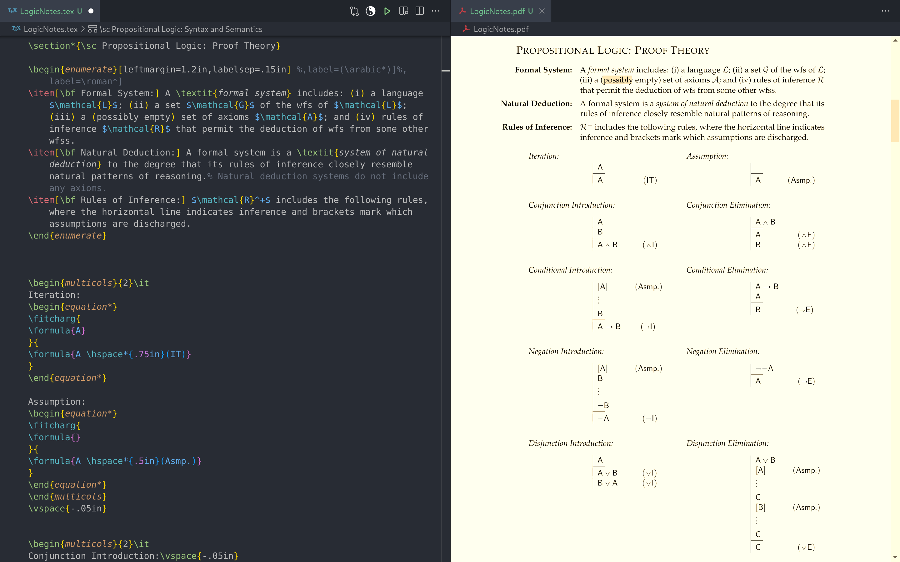

# [Introduction](#Table-of-Contents)

This repository aims to gather resources for using VSCodium to write in LaTeX, Markdown, and Python.
VSCodium offers a nice sweet of features while being extremely accessible.
By contrast, TexShop and TexMaker are painfully austere, offering none of the resources of a modern editor (e.g., LSP support, snippets, Git integration, etc.), Overleaf leaves its users stuck in the browser, and [NeoVim](https://github.com/benbrastmckie/.config) is much more difficult to install, configure, and learn to use.

The instructions below aim to streamline the process of adopting VSCodium as your daily driver for working with LaTeX and Mardown files with Python as a bonus.
This configuration provides a place to start and is easily adapted and extended.
Note that if you want to collaborate with others using Overleaf, it is possible to add Overleaf projects as remotes from which you can push and pull changes right from within VSCodium.
These details will be described [below](#Overleaf).

If you run into trouble, feel free to open an [issue](https://github.com/benbrastmckie/VSCodium/issues) in this repository, checking first to see that your issue was not already answered (search for both closed and open issues).
Since future users may find the answer to your issue helpful, GitHub issues are a nice way to not only solve the problems that you are facing, but also to contribute to the project by expanding its documentation.
With this in mind, make sure to adequately name the issue you create, providing a careful description of the problem and what you have tried already.
It is also important to stay on topic, opening new issues if you have separate problems.

If you find any errors in this documentation, you are welcome to submit a pull request by directly editing the `README.md` (click the pencil in the top right corner of this document).
That way your changes will be able to be easily reviewed and integrated.
If you feel that certain information is missing or would otherwise be helpful to include as a part of this project, don't hesitate to create an issue with your suggestions.




## [Table of Contents](#Introduction)

- [Installation](#Installation): install VSCodium along with some extensions
  - [Configuration](#Configuration): add the `settings.json` file
  - [Customization](#Customization): a few methods for customizing your configuration
- [Toolchain](#Toolchain): a collection of tools for academic writing
  - [LaTeX](#LaTeX): install LaTeX and set up the `texmf` directory
  - [Zotero](#Zotero): install Zotero and export your library with Better BibTeX
  - [Templates](#Templates): save and use LaTeX templates
  - [Snippets](#Snippets): edit and use snippets
  - [Markdown](#Markdown): use markdown to take notes and export quotes
  - [Pandoc](#Pandoc): convert between file types
  - [Python](#Python): install python along with some extensions
- [Git](#Git): basic overview with links to further information
	- [Forking the Repository](#Forking-the-Repository): make a copy of this repository to stay backed up
	- [Version Control](#Version-Control): using Git to backup and collaborate on projects
	- [Overleaf](#Overleaf): adding Overleaf remote repositories
  - [SSH Key](#SSH-Key): avoid having to enter your password when pushing changes

## [Installation](#Table-of-Contents)

Although VS Code is free and open source with a large plugin ecosystem, it is owned my Microsoft and so is not private as a result.
However, VSCodium is a community-driven distribution of [VS Code](https://code.visualstudio.com/) that is otherwise identical.
Download and install [VSCodium](https://vscodium.com/) for your operating system (or [VS Code](https://code.visualstudio.com/) if you prefer since all the same settings will continue to apply).
Once installed, open the "Extensions" tab on the top left, or hit `ctrl + shif + x`.
Search for and install the plugins 'LaTeX Workshop' as well as 'Two Monokai Theme'.

There are many other themes and plugins which you can explore.
You can even install a NeoVim plugin (by asvetliakov) to simulate the Vim motions in VSCodium (here are some [resources](https://github.com/benbrastmckie/.config/blob/master/CheatSheet.md#Learning-Vim) for learning Vim).
Some other popular themes include 'Gruvbox Theme', 'Tokyo Night', 'Atom One Dark', and 'Catppuccin'.
It is easy to switch between the themes that you have installed with `ctrl + shift + p` and typing 'Color Theme'.

## [Configuration](#Table-of-Contents)

> **NOTE:** If you prefer to use Git to clone a fork of this repository, see the [Git](#Git) section below.
> In addition to streamlining the process, using Git will allow you to easily backup your configuration as you make changes, tracking its complete history.
> Alternatively, the following method is very easy, but does not backup your configuration (this can be added later with a little extra hassle).

Open VSCodium and hit `ctrl + shift + p`, typing 'Preferences: Open User Settings (JSON)'.
This will open the `settings.json` file where you can declare your configuration.
Replace the entire contents of `settings.json` (i.e., you can replace the empty braces) with the contents of [this](https://github.com/benbrastmckie/VSCodium/blob/master/settings.json) file.
Save the document with `ctrl + s`, confirming that the changes have taken place (e.g., the theme should change to 'One Monokai').

Before making any changes to `settings.json`, it is advisable to fork this repository, backing up your configuration as described in [Git](#Git) below.
Alternatively, if you do make changes to `settings.json`, details will be provided below if you later wish to backup your configuration.

## [Customization](#Table-of-Contents)

In order to get a better sense of what the options are within VSCodium, click the settings gear in the bottom left corner.
By scrolling through, you can explore the many different features that you can change about VSCodium where the list will get longer with each plugin that you add.

Although the settings menu is a nice way to see all the options at once, this is not the easiest way to _reproduce_ your configuration.
However, any changes that you make in the settings menu will be stored in the `settings.json` file.
It is by backing up this file with a Git repository that you can easily reproduce your configuration without having to remember what settings you had before.
Although you could attempt to backup `settings.json` manually, the Git integration included in VSCodium provides an elegant way to stay backed up as you make changes to your configuration.
Accordingly, the [Git](#Git) section below will describe how to use Git to backup your configuration as well as your academic projects.

A further avenue for exploring customization is to use ChatGPT.
For instance, if there is something that you would like to change about VSCodium, you can ask ChatGPT what you should include in `settings.json` in order to make that change.
In case ChatGPT hallucinates, the false setting will not break anything, but rather will be dimmed with a warning that this setting does not exist.
You may also find helpful tutorials on YouTube.

# [Toolchain](#Table-of-Contents)

The following sections will provide information about how to set up LaTeX, reference management with Zotero, as well as how to make use of templates, snippets, Markdown, Pandoc, and Python.

## [LaTeX](#Table-of-Contents)

If you have not already set up LaTeX, you will have to install [MacTex](https://www.tug.org/mactex/) if you are on MacOS, [TexLive](https://www.tug.org/texlive/windows.html) if you are on Windows, or run the following if you are on Debian or Arch Linux, respectively:

```
sudo apt-get install texlive-full
sudo pacman -S texlive-most
```

It is preferable to install the "full" as opposed to "basic" set of LaTeX packages so that you never need to think about what `.sty` files you have installed ("full" should be installed by default if you are not presented with an option).

If you have installed LaTeX in the past but are uncertain whether you have the right packages installed, you can run the following commands in the terminal (on MacOS, hit `Cmd + Space` and type 'terminal'):

```
latexmk -v
synctex -v
biblatex -v
biber -v
```

So long as each of these commands returns a version number, you should not need to install LaTeX (though you may still be missing packages if you installed "basic" in the past).
Otherwise, you may need to install LaTeX as described above, or uninstall and reinstall to clean things up if it has been a while.

The final step is to create the ‘texmf’ directory in the appropriate location depending on your operating system as described below.

### [MacOS](#Table-of-Contents)

The 'texmf' directory lives in the (user) 'Library' directory which is hidden by default on MacOS.
To locate the ‘Library’ directory in Finder, hit `cmd + shift + h` to go to the 'Home' directory, `cmd + j` to open an options window, and check ‘show Library folder’.

You will now need to copy the [texmf](https://github.com/benbrastmckie/VSCodium/tree/master/texmf) directory into your 'Library' directory if it does not exist already.
The best way to do this is to begin by forking this repository on GitHub as described [below](#Git).

If you don't want to fork this repository, another option is to directly clone this repository, moving the 'texmf' directory to the appropriate location.
To do so, open the terminal and run the following commands:

```
cd ~/Downloads
git clone https://github.com/benbrastmckie/VSCodium.git
mv VSCodium/texmf ~/Library/texmf
find ~/Library/texmf -print | sed -e 's;[^/]*/;|____;g;s;____|; |;g'
```

The final command will display the contents of the 'texmf' directory.
The `bst` subdirectory contains all of the bibliographic style files (you may wish to add others).
The `latex` subdirectory contains the class files which you can use to typeset LaTeX documents (often provided by journals).
Alternatively, you can always include the relevant style or class files in the local project directory.

You are now free to delete the remnants of the 'VSCodium' repository that you cloned into 'Downloads' with the following command:

```
rm -r VSCodium
```

### [Linux and Windows](#Table-of-Contents)

The 'texmf' directory lives in the user's home directory on both Linux and Windows.
You will need to copy the [texmf](https://github.com/benbrastmckie/VSCodium/tree/master/texmf) directory into your home directory if it does not exist already.
The best way to do this is to begin by forking this repository on GitHub as described [below](#Git).

If you don't want to fork this repository, another option is to directly clone this repository, moving the 'texmf' directory to the appropriate location.
To do so, open the terminal and run the following commands:

```
cd ~/Downloads
git clone https://github.com/benbrastmckie/VSCodium.git
mv VSCodium/texmf ~/texmf
find ~/texmf -print | sed -e 's;[^/]*/;|____;g;s;____|; |;g'
```

You are now free to delete the remnants of the 'VSCodium' repository that you cloned into 'Downloads' with the following command:

```
rm -r VSCodium
```

## [Zotero](#Table-of-Contents)

Zotero is an open-source reference management software which does all the work for you of saving bibliography data, pdfs, notes, or other files.
Rather than ending up with an dizzying array of folders on your hard drive (or desktop!) crammed with documents, Zotero lets you easily create and destroy project folders without creating multiple versions of each paper (unless you want that).
Additionally, Zotero will download and organize the associated PDF with the reference, all with the click of a single button in your web browser.
That way, building your reference database is the passive result of sorting through papers that interest you online.
Most importantly, this software allows you to generate bibliographies from any selected project folders or files, and is compatible with most word processors.

Download and install Zotero together with a plugin for your preferred browser.

Now run a simple test, finding a paper you would like to download.
If you use a VPN provided by your research institution, make sure that it is turned on, and if you use an AdBlocker, make sure that it is not blocking pop-ups for the journal’s website.
Before downloading the paper as you normally would, notice the small Zotero icon in the top-right of your browser.
If Zotero has located a single paper, the icon will look like a paper.
If Zotero has located multiple papers, the icon will look like a folder.
Click the icon and, if need be, select the desired paper.
If all goes as it should, a small banner will pop up in the upper right-hand side of the screen that indicates that it has scraped the bibliographic data and downloaded the PDF, giving you the option to file the paper in a project folder if you desire.
Alternatively, if you open a project folder in Zotero by clicking on it on the left side of Zotero, then any papers you download will be automatically filed in that project folder.

Now switch from your browser to Zotero to check if the bibliographic data has been stored along with the PDF.
If it did not work, or did not grab the PDF with the bibliographic data, make sure you are logged into the journal website and repeat.
If problems persist, you can look for further answers here.

You can also always add the file manually by right-clicking the paper in question in Zotero.
Some of the journal websites work better than others.
For books, Amazon is a good resource for scraping bibliographic data, though no PDF will be downloaded.

### [Better BibTeX](#Table-of-Contents)

In order to integrate Zotero and LaTeX, download and install Better BibTex by following these [instructions](https://retorque.re/zotero-better-bibtex/installation/), restarting Zotero after the installation is complete.

Under ‘Edit’ in the Zotero menu bar, select ‘Preferences’ and open up the ‘Better BibTex’ tab.
Under the ‘Citation’ sub-tab, replace the citation key format with this:  auth + year.
> **Note:** This is just the look up key, not the citation style included in your bibliography.
> There are a lot of options for citation key styles [here](https://retorque.re/zotero-better-bibtex/citing/).
Also check ‘On item change’ at the bottom left.
Now switch to the ‘Automatic Export’ sub-tab and check ‘On Change’.
This means that the instant you update your database with a new bib entry, or edit an old bib entry, Zotero will update the .bib files where your database is exported.
If your library is extremely large, this could be slow, and so you might want to select the ‘When Idle’ option (this is not typically a problem).

Close the Preferences window, returning to the main Zotero window.
Right-click the main library folder in the left-most blue column, select ‘Export Library’ (alternatively you can export other project folders).
Under the ‘Format’ drop-down menu, select ‘Better BibTex’.
Then check the ‘Keep Updated’ box.
Save the file as ‘Zotero’ (the extension will be added automatically) to `texmf -> bibtex -> bib` directory that you [previously](#MacOS) created.

You can now run a test that everything is working.
Open VSCodium, create a new file, and copy this [template](https://github.com/benbrastmckie/VSCodium/blob/master/templates/PhilPaper.tex) into the file.
Save and click the 'Play' button on the top right corner, as well as the 'View LaTeX PDF' just beside it.
> **Note:** Occasionally, it can help to refresh the aux files if the PDF is not generating properly.
> You can do this by opening the 'TeX' tab on the left, clicking `Commands -> Build LaTeX project -> Clean up auxiliary files`.
Once your file typesets, open Zotero and click on one of the files in your library, and look for the ‘Citation Key’ in the details on the right.
If no key is present or if the key data is not of the form `[auth][year]`, you can right-click the file in your library and select ‘Generate BibTex Key’.
Once you have the key, you can cite this paper by writing ‘\citet{CITEKEY}’ in the tex file that you are creating (this must go in the body of the document).
> **Note:** To list multiple sources by the same, or different authors, separate the cite keys with a comma.
> For other citation styles, refer to the preamble of the [PhilPaper](https://github.com/benbrastmckie/VSCodium/blob/master/templates/PhilPaper.tex) template for further commands, e.g., ‘\citepos’ for possessive.
Upon saving, the citation should be automatically generated and added to the references.

If you have any trouble, make sure that the 'Zotero.bib' file has been correctly stored in the `textmf -> bibtex -> bib` directory as explained above (you might open this file to make sure it contains the right contents).
You should also confirm that `Phil_Review` is stored in `textmf -> bibtex -> bst`. 
Additionally, you can open the log by opening the 'TeX' tab on the left, clicking `Commands -> View Log messages -> View LaTeX compiler log`.
If you can't make out what the log is telling you, cut and paste any warnings or error messages into ChatGPT, asking it to interpret the messages for you.

## [Templates](#Table-of-Contents)

To be continued... 

> **Note:** If you are aware of a good plugin for managing template files, please feel free to submit a pull request by editing this [README.md](https://github.com/benbrastmckie/VSCodium/blob/master/README.md).

## [Snippets](#Table-of-Contents)

To be continued... 

> **Note:** If you are aware of a good plugin for managing snippets, please feel free to submit a pull request by editing this [README.md](https://github.com/benbrastmckie/VSCodium/blob/master/README.md).

## [Markdown](#Table-of-Contents)

Instead of taking notes in LaTeX, Word, or some other note-taking application, you can recover some of the elegance of LaTeX without any of the trouble by writing in Markdown.
The syntax for Markdown is by design as simple as possible, but can still produce a good looking document which you can then convert via Pandoc into other formats.

All that is required to use markdown is to create a file with the `.md` file extension in the "Explorer" tab.
For instance, you might create a 'TODO.md' or 'NOTES.md', etc.

More information on the markdown syntax can be found [here](https://www.markdownguide.org/basic-syntax/).

### [Zotero Add-On](#Table-of-Contents)

Zotero can be used not only to keep the pdfs associated with each citation organised, but to export the highlights and annotations you make with your preferred pdf viewer as markdown files.
In order to include these features, you will need to download the .xpi file for MdNotes as described here, as well as the .xpi file for ZotFile.
By then opening Zotero, navigating to the Tools –> Add-ons menu, clicking the gear symbol, and selecting ‘Install add-on from file’, you can select the .xpi files that you downloaded in order install these features.
You may then export your notes by: (1) right-clicking on the annotated pdf and selecting Manage Attachments –> Extract Annotations; followed by (2) right-clicking on the extraction that it generates and selecting MdNotes –> Export to Markdown, specifying the project folder you would like to save the notes in.


## [Pandoc](#Table-of-Contents)

Pandoc is a convenient utility for converting between different text formats.

To be continued... 

> **Note:** If you are aware of a good plugin for using pandoc, please feel free to submit a pull request by editing this [README.md](https://github.com/benbrastmckie/VSCodium/blob/master/README.md).

## [Python](#Table-of-Contents)

Install the 'Python' and 'Pylint' packages.

To be continued... 

# [Git](#Table-of-Contents)

This section will describe how to: 

  1. Create a fork of this repository, using Git to pull its contents on an appropriate directory on your computer.
  2. Add an SSH key to streamline pushing and pulling changes.
  3. Use VSCodium's Git integration to version control your academic projects as well as your config.

## [Forking the Repository](#Table-of-Contents)

In order to create your own copy of this repository, click `Fork` in the top right of this repository on GitHub.
You will then be presented with the choice to make yourself the owner which you should accept.
There is no need to include other branches besides the master branch which will be selected by default.
Do not select "Keep this repository private" unless you want to setup an SSH key (not a bad idea but requires another [few steps](#SSH-Key)) or want to type in you password every time.
It is also nice to keep configuration files public so that you can easily share them with others.

The next sections will describe the following two ways to use Git to backup your configuration:

  1. Use VSCodium's Git integration to add a fork of this repository as a remote, pulling down changes.
  2. Use the Git CLI to clone the contents into the appropriate folder on your machine.

### [Option 1: Git Integration](#Table-of-Contents)

Once you have forked the repository, you can click the `Code` button in the fork that you have created (you should see your username in the address).
If you have setup an SSH Key, you can select the SSH address, copying it to the clipboard.
Otherwise, copy the HTTPS address to the clipboard.

Open `setting.json` in VSCodium with `ctrl + shift + p` and typing 'Preferences: Open User Settings (JSON)'. 
Right-click on the file tab to 'Copy Path' to the `settings.json` file.
Open the "Explorer" tab on the top left, navigating to the directory which contains `settings.json`.
Note that you may need to show hidden files by right-clicking inside the search menu that VSCodium will open.

Open the "Source Control" tab also on the top left and select "Initialize Repository".
You can then add a remote by clicking the three dots in the top right of the "Source Control" panel, selecting `remote -> add`.
You can then enter the address copied to the clipboard from before, naming the remote "VSCodium" or whatever you like.

Note that if you have already made changes to the `settings.json` file on your machine, you will want to save those before proceeding.
One easy way to do this is to temporarily rename `settings.json` as `save.settings.json`.
That way, when you pull down the repository it will not replace your settings.
Instead, you can go on to delete the `settings.json` file that you pull down, changing the name of `save.settings.json` back to `settings.json`.
These extra steps can safely be ignored if you have not yet made any changes to `settings.json` as recommended above.

In the bottom left corner, you will see which branch you are on currently, clicking this branch to change to 'master'.
Next, click on the three dots in the top right corner of the "Source Control" pane to select `Pull, Push -> Pull`.
By changing back to the "Explorer" tab you should be able to see a host of new files.
Open `settings.json` to confirm that this file has been populated with settings.

If you go on to make any changes, you can save the changes by opening the "Source Control" tab, adding a message, and committing your changes.
Once committed, you can push your commits up to your repository with `Pull, Push -> Push`.
Note that unless you have added an [SSH key](#SSH-Key), you will need to enter you GitHub password.
You may also need to configure Git by adding your email (whatever you used to open a GitHub account).
To do so, open the terminal in VSCodium with `ctrl + backtick` and enter the following:

```
git config --global user.email "your_email@example.com"
```

Once this information has been provided, you should be able to push the changes that you make up to your repository so that they are available to pull down anywhere.

### [Option 2: Git CLI](#Table-of-Contents)

For completeness, here is the manual option, using the standard Git command line interface.

Open VSCodium, hitting `ctrl + shift + p` and typing 'Preferences: Open User Settings (JSON)'.
Once open, you can hover the mouse over the `settings.json` file to see its path.
Right-click the tab and select 'Copy Path' or hit `alt + ctrl + c` to do the same.
Open the terminal (on MacOS, hit `Cmd + Space` and type 'terminal') and run the following commands, replacing `PATH/TO` with the copied path minus 'settings.json':

```
cd PATH/TO/
ls -a
```

On MacOS, the `PATH/TO/` should be `~/Library/Application Support/VSCodium/User`.
The `ls` command should show the `settings.json` file.
If you have made extensive changes to `settings.json` that you want to preserve, you can create a backup with:

```
mv settings.json save.settings.json
ls -a
```

Click the `Code` button in the fork that you created previously (you should see your username in the address).
If you have an SSH Key (see [SSH Key](#SSH-Key) below), you can select the SSH address, copying it to the clipboard.
Otherwise, copy the HTTPS address to the clipboard.

Now initialize Git, link the remote repository, and pull down its contents by running each of the following commands:

```
git init
git remote add origin YOUR-FORK'S-ADDRESS
git remote -v
git pull origin master
ls -a
```

The `git remote -v` command is optional but will confirm that you succeeded in adding a remote.
The final command should show the new `settings.json` file along with the `.git` directory you initialized.
If you wanted to preserve your previously saved settings, you can now run the following commands:

```
rm settings.json
mv save.settings.json settings.json
```

If you make any changes to your config, you can push these up to your repository with:

```
git add . 
git commit -m "commit message of your choice"
git push origin master
```

Although it is good to know how to push and pull changes manually, VSCodium will automate all of this for you.
Instead of working in the terminal, you can open the "Explorer" tab in VSCodium on the top left, navigating to the directory containing `settings.json`.
You may need to turn on hidden files by right-clicking in the menu and selecting "Show Hidden Files".
VSCodium should automatically detect that this is a tracked directory.
You can then open the "Source Control" tab on the top left to commit changes, pushing commits up to your repository.

## [Version Control](#Table-of-Contents)

To be continued... 

## [Overleaf](#Table-of-Contents)

Open Overleaf, click on the Git icon or go to `Menu -> Git -> Sync` and get the Git URL `https://git.overleaf.com/your-project-id`.
You will then be able to add the remote with:

```
git remote add overleaf https://git.overleaf.com/your-project-id
```

## [SSH Key](#Table-of-Contents)

If you have not already, you can add an SSH key by amending and running the following in the terminal:

```
ssh-keygen -t rsa -b 4096 -C "your_email@example.com"
```

Hit `return` once, entering your GitHub passphrase in response to the prompt.
Next run:

```
eval "$(ssh-agent -s)"
ssh-add ~/.ssh/id_rsa
```

Run the following to copy the SSH key to your system clipboard:

```
pbcopy < ~/.ssh/id_rsa.pub
```

In the top right corner of your GitHub page, click `Profile -> Settings -> SSH and GPG Keys` selecting `New SSH Key`.
Name the authentication key after the devise you are using, pasting the SSH key from the clipboard into the appropriate field.
Saving the key completes the addition.

Check to make sure that the SSH key is working by pushing commits up to one of your repositories as directed above.
If your SSH key stops working after rebooting, run the following command:

```
ssh-add -K ~/.ssh/id_rsa
```

If you get an error, retry the command above with a lower-case 'k' or without the 'K' altogether.

