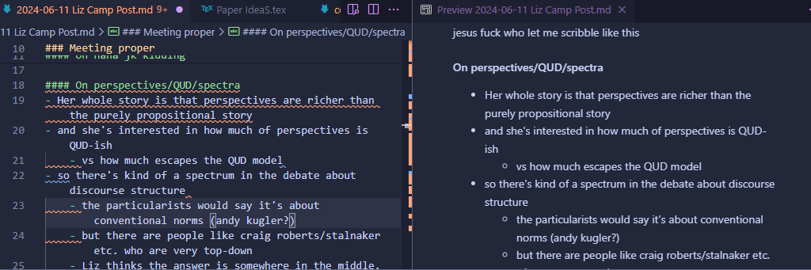

# [Introduction](#Table-of-Contents)

This repository gathers resources for using [VSCodium](https://vscodium.com/) (the private but otherwise identical version of [VS Code](https://code.visualstudio.com/)) to write in [LaTeX](https://www.latex-project.org/), [Markdown](https://www.markdownguide.org/), or any programming languages that you might want to use.
VSCodium offers a nice suite of features while being extremely accessible and easy to configure.
By contrast, TexShop and TexMaker are painfully austere, offering none of the resources of a modern text editor (e.g., LSP support, snippets, Git integration, syntax highlighting, etc.), Overleaf is limited to the browser and requires internet access, and [NeoVim](https://github.com/benbrastmckie/.config) is much more difficult to install, configure, and learn to use.

The instructions below aim to streamline the process of adopting VSCodium as your daily driver for composing and editing text of all kinds.
Even if you are new to LaTeX and Mardown or do not already have LaTeX installed, this configuration provides a place to start with all the information and instructions that you will need in one place.
The configuration is modular and easy to extend to include further utilities for writing, taking notes, managing your workflow, staying organized, or for working with other languages such as Python etc. (there is a large ecosystem of plugins).

Further resources will also be provided for how to use [Zotero](https://www.zotero.org/) to manage your references with associated PDFs, providing citation key autocompletion within VSCodium.
Additionally, information will be included for how to use [Git](https://git-scm.com/) (a sophisticated version control software that is widely used and already integrated into VSCodium) to manage your projects, backup your work as you go, work on the same project from multiple computers, collaborate with others, and maintain your configuration of VSCodium.
Note that if you want to collaborate with others using Overleaf, it is possible to [add Overleaf projects as a remote](https://www.overleaf.com/learn/how-to/Git_integration#Synchronizing_with_another_remote) from which you can easily push and pull changes without leaving VSCodium.

This repository also aims to provide community support.
For instance, if you run into trouble you can open an issue by clicking the [issues tab](https://github.com/benbrastmckie/VSCodium/issues) above, checking first to see that your issue was not already answered (search for both open and closed issues).
Since future users may find the responses to your issue helpful, GitHub issues are a nice way to not only solve the problems that you are facing, but to contribute to the project by expanding its surrounding documentation.
With this in mind, make sure to appropriately name the issue you create, providing a careful description of the problem and what you have tried already.
It is also important to stay on topic, opening new issues if you have separate problems rather than lumping them altogether.

If you find any errors in this documentation, you are welcome to submit a pull request by directly editing this `README.md` [document](https://github.com/benbrastmckie/VSCodium/blob/master/README.md) (click the edit icon in the top right corner).
That way your changes will be able to be easily reviewed and integrated into the project.
If you feel that certain information is missing or would otherwise be helpful to include as a part of this project, don't hesitate to create an issue with your suggestions.

### LaTeX Screenshot

<!-- ### Markdown Screenshot -->
<!---->
<!--  -->

## [Table of Contents](#Introduction)

The follow sections will be devoted to installing and configuring VSCodium.
Additional documentation is provided for installing [LaTeX](https://github.com/benbrastmckie/VSCodium/blob/master/docs/latex.md), [Zotero](https://github.com/benbrastmckie/VSCodium/blob/master/docs/zotero.md), and using [Git](https://github.com/benbrastmckie/VSCodium/blob/master/docs/git.md).

- [Installation](#Installation): install VSCodium and some extensions
  - [Configuration](#Configuration): add the `settings.json` file
  - [Customization](#Customization): methods for customizing your configuration
- [Toolchain](#Toolchain): a collection of tools for academic writing
  - [Templates](#Templates): save and use LaTeX templates
  - [Snippets](#Snippets): save and use snippets
  - [Markdown](#Markdown): use markdown to take notes and export quotes
  - [Pandoc](#Pandoc): convert between file types
  - [Python](#Python): install python along with some extensions

> **Note:** To facilitate navigation, headers are linked back to the table of contents given here.

## [Installation](#Table-of-Contents)

Although [VS Code](https://code.visualstudio.com/) is free and open source, it is owned by Microsoft and so your data is not private as a result.
By contrast, VSCodium is a community-driven distribution of VS Code that is otherwise identical (compare Chromium to Google Chrome).
To get started, download and install [VSCodium](https://vscodium.com/) for your operating system.

> **Note:** If you prefer to install VS Code, all the same settings will continue to apply, though some of the paths will differ.
> For instance, on MacOS, VS Code stores the `settings.json` file in `~/Library/Application Support/Code/User` instead of in `~/Library/Application Support/VSCodium/User`.

Once installed, open the "Extensions" tab on the top left, or hit `ctrl + shift + x`.
Search for and install the plugins 'LaTeX Workshop' as well as 'Two Monokai Theme' (this is required for the `settings.json` configuration to "just work").
It is easy to switch between themes, where these details will be covered [below](#Customization).

There are many other themes and plugins which you can try out.
You can even install a NeoVim plugin (by asvetliakov) to simulate the Vim motions in VSCodium. 
Here are some additional [resources](https://github.com/benbrastmckie/.config/blob/master/CheatSheet.md#Learning-Vim).
If you are serious about learning to use the Vim motions, you would do best to use [NeoVim](https://github.com/benbrastmckie/.config).

## [Configuration](#Table-of-Contents)

> **NOTE:** If you are familiar with Git or interested in giving it a try, the best way to proceed is to fork this repository, using Git to clone your fork onto your machine.
> These details will be described in the documentation for [Git](https://github.com/benbrastmckie/VSCodium/blob/master/docs/git.md).
> In addition to streamlining the process, this method will allow you to easily backup your configuration as you make changes, tracking its complete history.
> Alternatively, the following brute-force method is very easy, but does not backup your configuration (this can be added later with a little extra hassle).

Open VSCodium and hit `ctrl + shift + p`, typing 'Preferences: Open User Settings (JSON)'.
This will open the `settings.json` file where you can declare your configuration.
Replace the entire contents of `settings.json` (including the empty braces) with the entire contents of [this](https://github.com/benbrastmckie/VSCodium/blob/master/settings.json) file.
Save the document with `ctrl + s`, confirming that the changes have taken place (e.g., note that the theme should change).

This completes the basic configuration of VSCodium.

## [Customization](#Table-of-Contents)

In order to get a better sense of what the options are within VSCodium, click the settings gear in the bottom left corner.
By scrolling through, you can explore the many different features that you can change about VSCodium where the list will get longer with each plugin that you add.
In particular, some popular themes include 'Gruvbox Theme', 'Tokyo Night', 'Atom One Dark', and 'Catppuccin'.
You can switch between the themes that you have installed with `ctrl + shift + p` and typing 'Color Theme'.

Although the settings menu is a nice way to see all the options at once, this is not the easiest way to save or reproduce your configuration.
However, any changes that you make in the settings menu will be stored in the `settings.json` file.
It is by backing up this settings file that you can easily reproduce your configuration without having to remember what settings you had before or scroll through endless options.
Although you could attempt to backup `settings.json` manually, the Git integration included in VSCodium provides an elegant way to stay backed up as you make changes to your configuration.
These details are described in the documentation provided for [Git](https://github.com/benbrastmckie/VSCodium/blob/master/docs/git.md).

A further avenue for exploring the different ways of customizing VSCodium is to use ChatGPT.
For instance, if there is something that you would like to change about VSCodium, you can ask ChatGPT what you should include in `settings.json` in order to make that change.
In case ChatGPT hallucinates, the false setting will not break anything, but rather will be dimmed with a warning that this setting does not exist.
You can easily remove any false settings by deleting those lines from your configuration.
You may also find helpful tutorials on YouTube.

# [Toolchain](#Table-of-Contents)

Instructions for installing and integrating [LaTeX](https://github.com/benbrastmckie/VSCodium/blob/master/docs/latex.md) and [Zotero](https://github.com/benbrastmckie/VSCodium/blob/master/docs/zotero.md) into your configuration of VSCodium are provided separately for ease.
If you have not already installed those elements, you can do so now.

The following optional sections will provide additional information about how make use of Markdown, templates, snippets, Pandoc, and Python.

## [Markdown](#Table-of-Contents)

Instead of taking notes in LaTeX, Word, or some other note-taking application, you can recover some of the elegance of LaTeX without any of the trouble by writing in Markdown.
The syntax for Markdown is by design as simple as possible, but can still produce a good looking document (think Notion) which you can then convert via Pandoc into other formats.

All that is required to use markdown is to create a file with the `.md` file extension in the "Explorer" tab.
For instance, you might create a 'TODO.md' or 'NOTES.md', etc.

More information on the markdown syntax can be found [here](https://www.markdownguide.org/basic-syntax/).

### Zotero Add-On

Zotero can be used not only to keep the PDFs associated with each citation organised, but to export the highlights and annotations you make with your preferred PDF viewer as markdown files.
In order to include these features, you will need to download the .xpi file for MdNotes as described here, as well as the .xpi file for ZotFile.
By then opening Zotero, navigating to the Tools –> Add-ons menu, clicking the gear symbol, and selecting ‘Install add-on from file’, you can select the .xpi files that you downloaded in order install these features.
You may then export your notes by: (1) right-clicking on the annotated PDF and selecting Manage Attachments –> Extract Annotations; followed by (2) right-clicking on the extraction that it generates and selecting MdNotes –> Export to Markdown, specifying the project folder you would like to save the notes in.

### Obsidian 

To be continued... 

> **Note:** If you know how to setup VSCode for working with Obsidian, please feel free to submit a pull request by editing this [README.md](https://github.com/benbrastmckie/VSCodium/blob/master/README.md).

### TODO List

To be continued... 

> **Note:** If you are aware of a good plugin for managing TODOs, please feel free to submit a pull request by editing this [README.md](https://github.com/benbrastmckie/VSCodium/blob/master/README.md).

## [Templates](#Table-of-Contents)

To be continued... 

> **Note:** If you are aware of a good plugin for managing template files, please feel free to submit a pull request by editing this [README.md](https://github.com/benbrastmckie/VSCodium/blob/master/README.md).

## [Snippets](#Table-of-Contents)

To be continued... 

> **Note:** If you are aware of a good plugin for managing snippets, please feel free to submit a pull request by editing this [README.md](https://github.com/benbrastmckie/VSCodium/blob/master/README.md).

## [Pandoc](#Table-of-Contents)

Pandoc is a convenient utility for converting between different text formats.

To be continued... 

> **Note:** If you are aware of a good plugin for using pandoc, please feel free to submit a pull request by editing this [README.md](https://github.com/benbrastmckie/VSCodium/blob/master/README.md).

## [Python](#Table-of-Contents)

Install the 'Python' and 'Pylint' packages.

To be continued...
